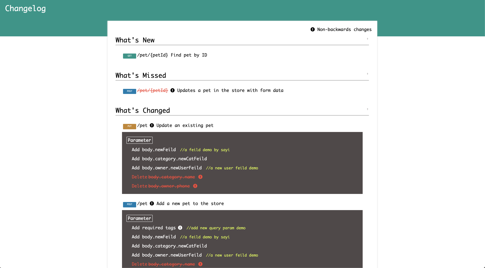
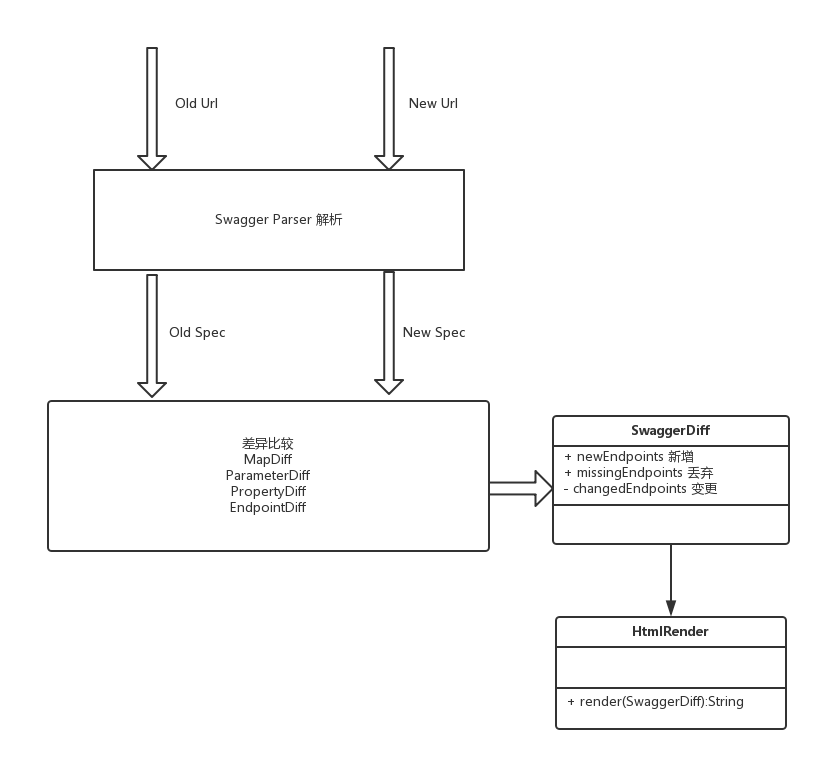

## swagger-diff

  [](https://coveralls.io/github/Sayi/swagger-diff) [](https://maven-badges.herokuapp.com/maven-central/com.deepoove/swagger-diff)

Compare two swagger API specifications(1.x or v2.0) and render the difference to html file or markdown file.

## :black_large_square: Command line interface (CLI) 

```shell
$ java -jar swagger-diff.jar --help
Usage: java -jar swagger-diff.jar [options]
  Options:
  * -old
      old api-doc location:Json file path or Http url
  * -new
      new api-doc location:Json file path or Http url
    -v
      swagger version:1.0 or 2.0
      Default: 2.0
    -output-mode
      render mode: markdown or html
      Default: markdown
    --help

    --version
      swagger-diff tool version
```
Here is one command-line example(`-old` and `-new` is required, `-v` and `-output-mode` is optional):
```shell
java -jar swagger-diff.jar \
-old http://petstore.swagger.io/v2/swagger.json \
-new http://petstore.swagger.io/v2/swagger.json \
-v 2.0 \
-output-mode html > diff.html
```
Download the fatJar or view the changelog on the **[Release Page](https://github.com/Sayi/swagger-diff/releases),** and thanks to all contributors.

## Feature
* Supports swagger spec v1.x and v2.0.
* Depth comparison of parameters, responses, notes, http method(GET,POST,PUT,DELETE...)
* Supports swagger api Authorization
* Render difference of property with Expression Language
* html & markdown render
* Command line interface

## Maven
```xml
<dependency>
  <groupId>com.deepoove</groupId>
  <artifactId>swagger-diff</artifactId>
  <version>1.2.2</version>
</dependency>
```

## Gradle
```shell
compile group: 'com.deepoove', name: 'swagger-diff', version: '1.2.2'
```

## Usage
SwaggerDiff can read swagger api spec from json file or http.
```java
SwaggerDiff diff = SwaggerDiff.compareV2("petstore_v2_1.json", "http://petstore.swagger.io/v2/swagger.json");
```
## Swagger version
v1.x
```java
SwaggerDiff.compareV1("petstore_v1_1.json", "petstore_v1_2.json");
```

v2.0
```java
SwaggerDiff.compareV2("petstore_v2_1.json", "petstore_v2_2.json");
```

## Render difference
#### HTML
```java
String html = new HtmlRender("Changelog",
        "http://deepoove.com/swagger-diff/stylesheets/demo.css")
                .render(diff);

try {
    FileWriter fw = new FileWriter("testNewApi.html");
    fw.write(html);
    fw.close();
} catch (IOException e) {
    e.printStackTrace();
}
```


#### Markdown
```java
String render = new MarkdownRender().render(diff);
try {
    FileWriter fw = new FileWriter("testDiff.md");
    fw.write(render);
    fw.close();
} catch (IOException e) {
    e.printStackTrace();
}
```
```markdown
### What's New
---
* `GET` /pet/{petId} Find pet by ID

### What's Deprecated
---
* `POST` /pet/{petId} Updates a pet in the store with form data

### What's Changed
---
* `PUT` /pet Update an existing pet  
    Parameter

        Add body.newFeild //a feild demo by sayi
        Add body.category.newCatFeild
        Delete body.category.name
* `POST` /pet Add a new pet to the store  
    Parameter

        Add tags //add new query param demo
        Add body.newFeild //a feild demo by sayi
        Add body.category.newCatFeild
        Delete body.category.name
* `DELETE` /pet/{petId} Deletes a pet  
    Parameter

        Add newHeaderParam
* `POST` /pet/{petId}/uploadImage uploads an image for pet  
    Parameter

        petId change into not required Notes ID of pet to update change into ID of pet to update, default false
* `POST` /user Create user  
    Parameter

        Add body.newUserFeild //a new user feild demo
        Delete body.phone
* `GET` /user/login Logs user into the system  
    Parameter

        Delete password //The password for login in clear text
* `GET` /user/{username} Get user by user name  
    Return Type

        Add newUserFeild //a new user feild demo
        Delete phone
* `PUT` /user/{username} Updated user  
    Parameter

        Add body.newUserFeild //a new user feild demo
        Delete body.phone

```

## How it works



